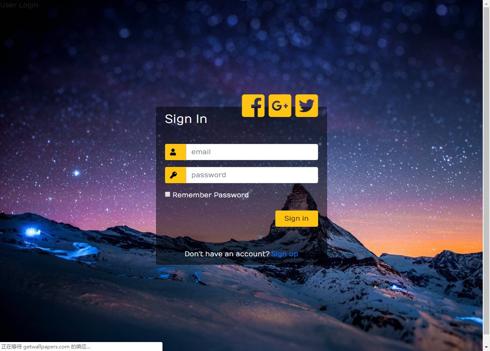

# 环境准备

> 作者环境：
> + 操作系统： win10
> + Python： Python 3.7.1
> + Ide：PyCharm
> + 数据库：MySQL
> + 第三方库：
>   + Flask
>   + Flask-login
>   + Flask-sqlalchemy
>   + cymysql
>   + wtforms

## 安装虚拟环境

虚拟环境的好处，项目跟你之前的环境完全隔离，这是一个全新的环境，一切都是 0 开始。

```bash
$ pip install pipenv
```


## 给项目创建虚拟环境

如果你想把`工作目录`和`项目目录`分开，你需要在环境变量中设置`WORKON_HOME`。默认是没有分开的，执行`pipenv install`后会创建两个文件夹。

```bash
# clone 项目
$ git clone git@github.com:openexw/flask_crud.git

# 进入项目目录
$ cd flask_crud

# 安装虚拟环境，并安装 Pipfile 中的所有依赖
$ pipenv install

# 启动虚拟环境
$ pipenv shell
```

# 启动项目

> 启动项目之前，请注意在 config/database.py 下配置好自己的数据库
```bash
$ python main.py
```

# 成品

> 在浏览器中输入 `127.0.0.1:8001` 即可访问

## 截图





